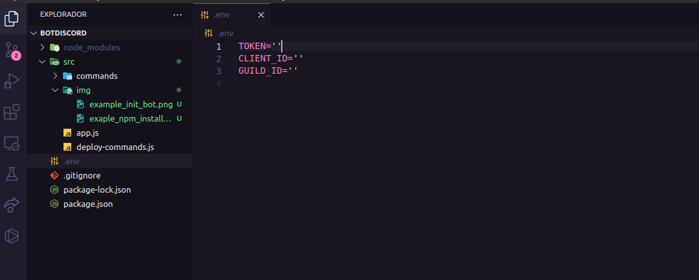
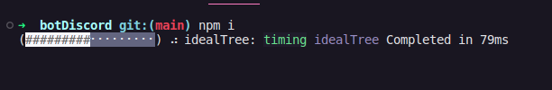
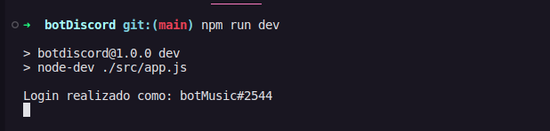
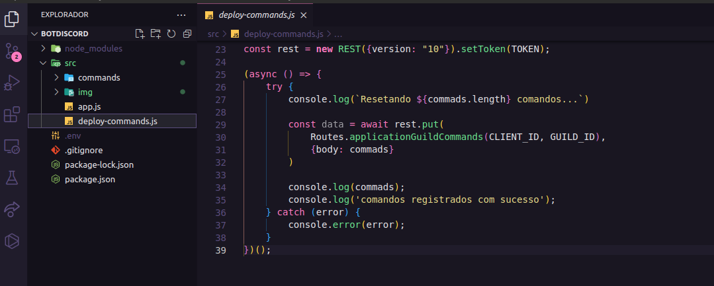

# discorBot
Um template de BOT para o Discord feito com o discord.js

### Como iniciar: 🚀
  1 - Para iniciar o sistema do Bot, primeiro deve ser criada uma conta especifica para ele no site do [discord developer](https://discord.com/developers/applications).
  Logo após o registro da conta, devem ser preenchidas as vareáveis de ambiente, presentes no arquivo `.env` localizado na raiz do projeto.
 
  
 
  2 - Após preencher os arquivos com os dados necessários, inicie no terminal o comando `npm i`, para poder instalar as dependências necessárias para que o BOT funcione,
  aguarde o processo de instalação das dependências necessárias para pode continuar o processo de inicialização do BOT.
 
  
 
  3 - Após todos os processos o BOT está pronto para ser iniciado. Para isso digite no terminal o comando `npm run dev` e tecle `Enter` e logo aparecera uma mensagem informando que o BOT foi iniciado.
 
  
 
  ### Adição de novos SlashCommands: 🔩
  Para adicionar novos comandos de `/` e template já vem com uma pasta no destino `./scr/commands`, onde deveram ser criadas as novas interações.
  Para mandar fazer ‘upload’ dos novos comandos, o desenvolvedor deve digitar no terminal o comando `npm run deploy`, que por sua vez, iniciara o arquivo `deploy-commands.js`
  responsável por realizar essa tarefa.
 
  
 
  ### OBS: 🚨
  #### 📗 - Divirta-se desenvolvendo novas funcionalidades para o seu próprio BOT!!! Novas atualizações podem aparecer no template, então fique de olho 👀.
